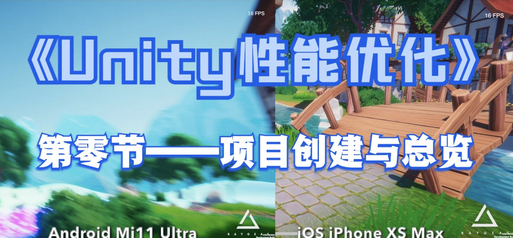

## 2022年1月11日 第零讲 项目创建与总览



#### 项目创建与资源导入步骤：

1. 下载优化工程：

   ```
   git clone git@github.com:lwwhb/Unity2022_SUNTAIL_Stylized_Fantasy_Village_Optimization.git
   ```

2. 打开Unity2022_SUNTAIL_Stylized_Fantasy_Village_Optimization工程，下载SUNTAIL - Stylized Fantasy Village资源包并导入

3. 解压Assets/Suntail Village/SRP Packages/URP (2021.2+).unitypackage资源包

4. 通过Unity编辑器**Edit > Project Setiings > Graphics > Scriptable Render Pipeline Settings**选择"SuntailUniversalRenderPipelineAsset.asset"为默认管线设置。

5. 打开Assets/Suntail Village/Demo/Suntail Village.unity场景文件，显示正常即可

####  项目未优化时的一些参考指标数据

- 生成的Android APK大小 550M
-  三角形平均面熟150-200万，峰值230万
- 渲染批次1500-1800次
- SetPassCall 200次以上
- 小米11 ultra平均FPS 10FPS,  iPhone XS Max 15FPS
- 内存 小米11 ultra 1.5GB,  iPhone XS Max 1GB
- 纹理资源小米11 ultra 670M,  iPhone XS Max 530M
- Mesh资源小米11 ultra 423M,  iPhone XS Max 423M
- 音效资源小米11 ultra 76M,  iPhone XS Max 76M
