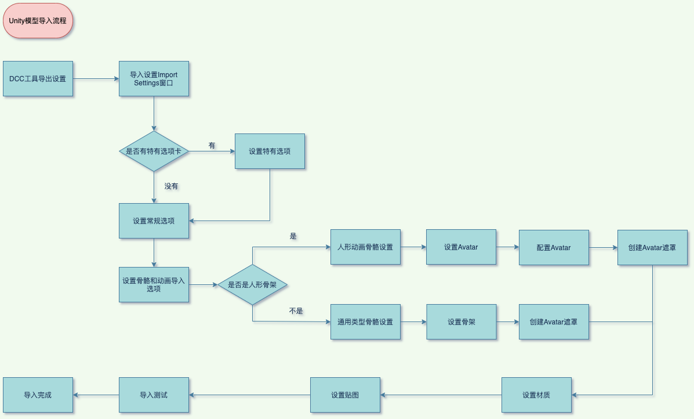

## 2022年1月25日 第贰讲 Model导入设置检查与优化.md

- **DCC中模型导出**

  - Unity 支持多种标准和专有模型文件格式（DCC）。Unity 内部使用 .fbx 文件格式作为其导入链。最佳做法尽可能使用 .fbx 文件格式，并且不应在生产中使用专有文件格式。
  - 优化原始导入模型文件，删除不需要的数据
    - 统一单位
    - 导出的网格必须是多边形拓扑网格，不能是贝塞尔曲线、样条曲线、NURBS、NURMS、细分曲面等
    - 烘培Deformers,在导出之前，确保变形体被烘培到网格模型上，如骨骼形变烘培到蒙皮权重上
    - 不建议模型使用到的纹理随模型导出
    - 如果你需要导入blend shape normals，必须要指定光滑组smooth groups
    - DCC导出面板设置, 不建议携带场景信息导出，如不建议导出摄像机、灯光、材质等信息，因为这些的信息与Unity内默认都不同。除非你自己为某DCC做过自定义导出插件。

- Unity模型导入流程

  

- 原始模型文件对性能的影响点

  - 最小化面数，不要使用微三角形，分布尽量均匀
  - 合理的网络拓扑和平滑组
  - 尽量少的使用材质个数
  - 尽可能少的使用蒙皮网格
  - 尽可能少的骨骼数量
  - FK与IK节点没分离，IK节点没删除

- 模型优化

  - 尽可能的将网格合并到一起，（）
  - 尽可能使用共享材质
  - 不要使用网格碰撞体
  - 不必要不要开启网格读写
  - 使用合理的LOD级别
  - Skin Weights受骨骼影响个过多
  - 合理压缩网格
  - 不需要rigs和BlendShapes尽量关闭
  - 如果可能，禁用法线或切线
  - 多套模型

- **资源检查报告——FBX部分问题解读**

  - 其中两项建议与模型动画有关，而测试项目中所有模型资源都不涉及动画，可以将Rig标签下的Animation Type设置为None，并关闭Animation标签下的Import Animations选项，设置Materials标签中的Material Creation Mode为None.
  - 开启Project Settings——>Player——>Optimization下的Vertex Compression与Optimize Mesh Data选项

- 优化成果

  - 包体大小前后没变化，依然是544.6M
  - 运行时模型内存优化前为422.9M，优化后为400.5M，相差的22M来自于运行时CombinedMesh开销的节省。后期运行时模型资源优化才是我们的重点。