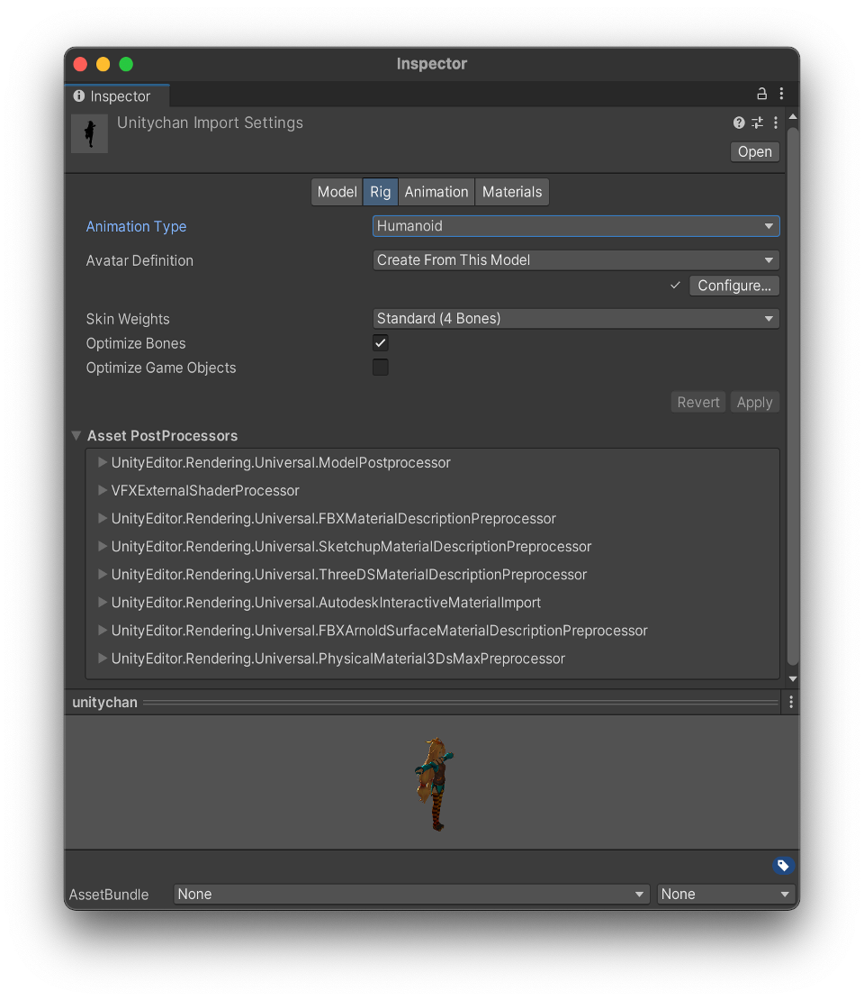
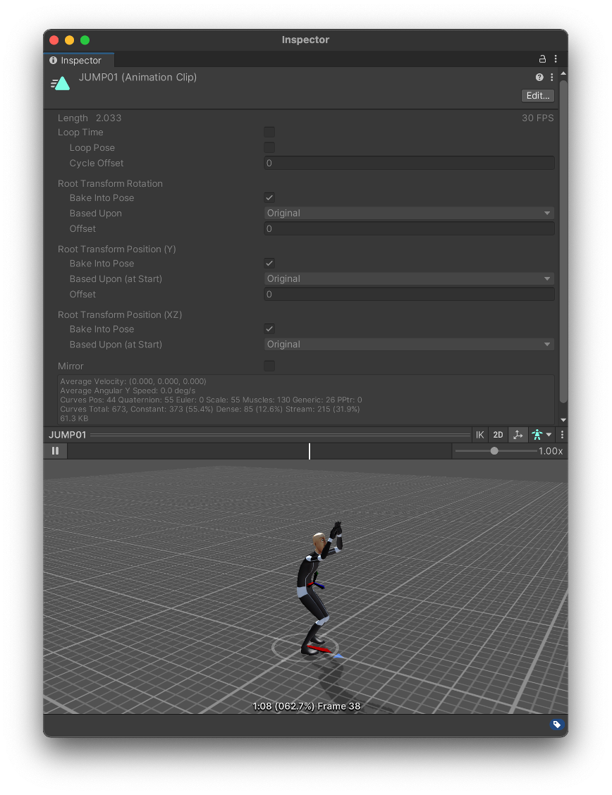

## 2022年2月15日 第伍讲 Animation导入设置检查与优化

### Rig标签页

**Animation Type**

- None 无动画
- Legacy 旧版动画，不要用
- Generic  通用骨骼框架
- Humanoid 人形骨骼框架

**选择原则：**

- 无动画选择None
- 非人形动画选择Generic
- 人形动画
  - 人形动画需要Kinematices或Animation Retargeting功能，或者没有有自定义骨骼对象时选择Humanoid Rig
  - 其他都选择Generic Rig，在骨骼数差不多的情况下,Generic Rig会比Humanoid Rig省30%甚至更多的CPU的时间。

**Skin Weights**

​		默认4根骨头，但对于一些不重要的动画对象可以减少到1根，节省计算量

**Optimize Bones**

​		建议开启，在导入时自动剔除没有蒙皮顶点的骨骼

**Optimize Game Objects**

​		在Avatar和Animatior组件中删除导入游戏角色对象的变换层级结构，而使用Unity动画内部结构骨骼，消减骨骼transform带来的性能开销。可以提高角色动画性能, 但有些情况下会造成角色动画错误，这个选项可以尝试开启但要看表现效果而定。注意如果你的角色是可以换装的，在导入时不要开启此选项，但在换装后在运行时在代码中通过调用AnimatorUtility.OptimizeTransformHierarchy接口仍然可以达到此选项效果。

### Animation标签页

**Resmple Curves** 

​		将动画曲线重新采样为四元数数值，并为动画每帧生成一个新的四元数关键帧，仅当导入动画文件包含尤拉曲线时才会显示此选项

**Anim.Compression**

- **Off** 不压缩,质量最高，内存消耗最大
- **Keyframe Reduction** 减少冗余关键帧，减小动画文件大小和内存大小。
- **Keyframe Reduction and Compression** 减小关键帧的同时对关键帧存储数据进行压缩，只影响文件大小。
- **Optimal**，仅适用于Generic与Humanoide动画类型，Unity决定如何进行压缩。

**Animation Custom Properties**

​	导入用户自定义属性，一般对应**DCC**工具中的**extraUserProperties**字段中定义的数据

### 动画曲线数据信息

- **Curves Pos:** 位置曲线
- **Quaternion:** 四元数曲线 **Resample Curves**开启会有
- **Euler:** 尤拉曲线
- **Scale:** 缩放曲线
- **Muscles:** 肌肉曲线，**Humanoid**类型下会有
- **Generic:** 一般属性动画曲线，如颜色，材质等
- **PPtr：**精灵动画曲线，一般2D系统下会有
- **Curves Total: **曲线总数
- **Constant:** 优化为常数的曲线
- **Dense:** 使用了密集数据（线性插值后的离散值）存储
- **Stream:** 使用了流式数据（插值的时间和切线数据）存储

#### 动画文件导入设置优化后信息查看原则

1. 一看效果差异（与原始制作动画差异是否明显）
2. 二看曲线数量（总曲线数量与各种曲线数显，常量曲线比重大更好）
3. 三看动画文件大小（以移动平台为例，动画文件在小几百k或更少为合理，查过1M以上的动画文件考虑是否进行了合理优化）

