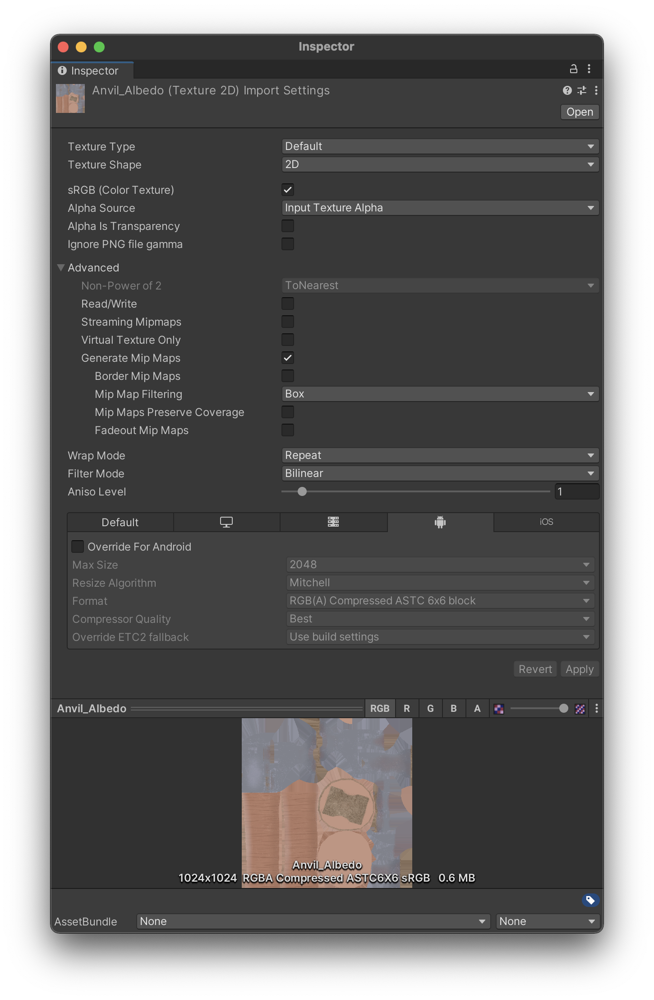
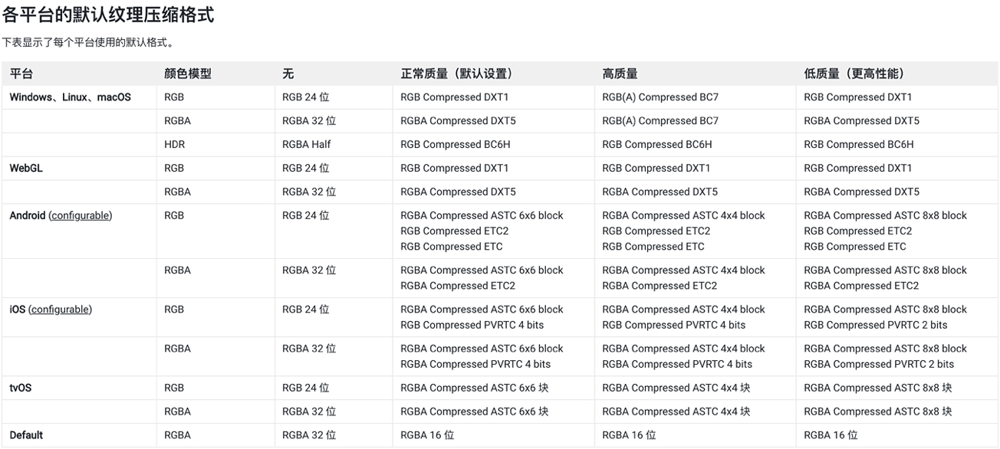
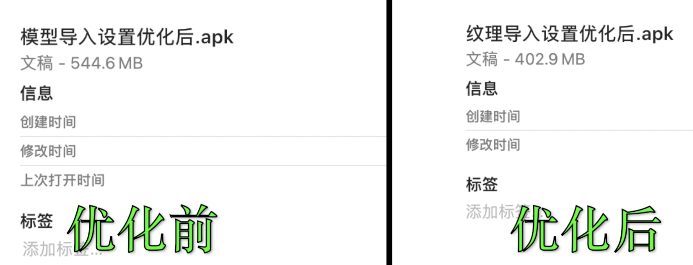
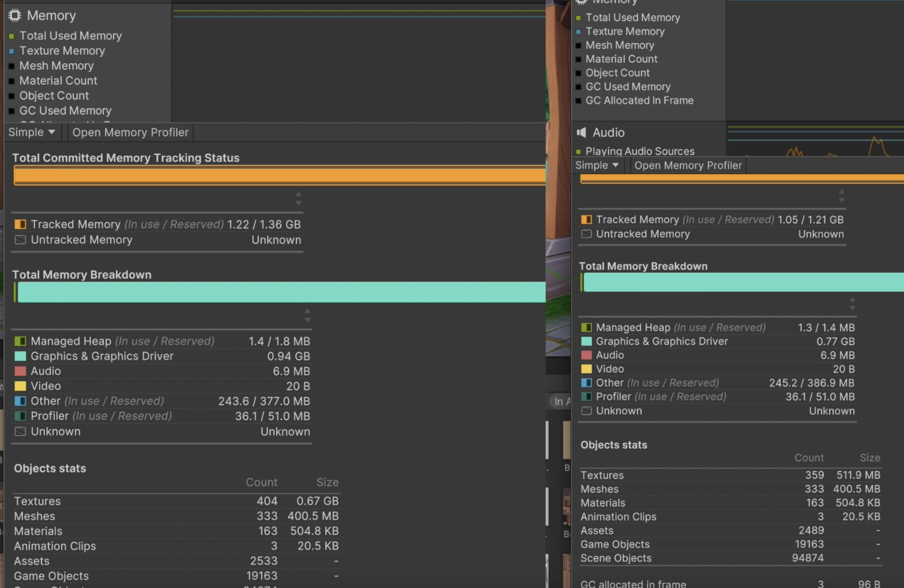

## 2022年2月8日 第肆讲 Texture导入设置检查与优化

#### **Texture Shape**

- 2D 最常用的2D纹理，默认选项 
- Cube 一般用于天空和与反射探针，默认支持Default、Normal、Single Channel几种类型纹理，可以通过Assets > Create > Legacy > Cubemap生成，也可以通过C#代码 Camera.RenderToCubemap在脚本中生成 
- 2D Array 2D纹理数组，可以极大提高大量相同大小和格式的纹理访问效率，但需要特定平台支持，可以通过引擎SystemInfo.supports2DArrayTextures 接口运行时查看是否支持。
- 3D 通过纹理位图方式存储或传递一些3D结构话数据，一般用于体积仿真，如雾效、噪声、体积数据、距离场、动画数据等信息，可以外部导入，也可运行时程序化创建。

#### **Alpha Source**

默认选择Input Texture Alpha就好，如果确定不使用原图中的Alpha通道，可以选择None。另外From Gray Scale我们一般不会选用

#### **Alpha Is Transparency**

指定Alpha通道是否开启半透明，如果位图像素不关心是否要半透明可以不开启此选项。这样Alpha信息只需要占1bit。节省内存

#### **Ignore** **Png** **file gamma**

是否忽略png文件中的gamma属性，这个选项是否忽略取决于png文件中设置不同gamma属性导致的显示不正常，一般原图制作流程没有特殊设置，这个选项一般默认就好。

#### **Read/Write**

开启此选项会导致内存量增加一倍，默认我们都是不开启，除非你的脚本逻辑中需要动态读写该纹理时需要打开此选项。

**Streaming Mipmaps**(Texture Streaming部分讲解)

**Virtual Texture Only**(虚拟部分讲解)

#### **Generate** **Mip** **Maps**

什么时候不需要生成MipMaps？

1. 2D场景
2. 固定视角，摄像机无法缩放远近

- **Border** **Mip** **Maps** 默认不开启，只有当纹理的是Light Cookies类型时，开启此选项来避免colors bleeding现象导致颜色渗透到较低级别的Mip Level纹理边缘上
- **MipMap Filtering**
  - **Box** 最简单，随尺寸减小，Mipmap纹理变得平滑模糊
  - **Kaiser**，避免平滑模糊的锐化过滤算法。
- **Mip Maps Preserve Coverage**，只有需要纹理在开启mipmap后也需要做Alpha Coverage时开启。默认不开启。
- **Fadeout MipMaps,** 纹理Mipmap随Mip层级淡化为灰色，一般不开启，只有在雾效较大时开启不影响视觉效果。

#### **选择合适纹理过滤的最佳经验：**

- 使用双线性过滤平衡性能和视觉质量。
- 有选择地使用三线性过滤，因为与双线性过滤相比，它需要更多的内存带宽。
- 使用双线性和 2x 各向异性过滤，而不是三线性和 1x 各向异性过滤，因为这样做不仅视觉效果更好，而且性能也更高。
- 保持较低的各向异性级别。仅对关键游戏资源使用高于 2 的级别。

#### 其他可能有问题的纹理类型

- 纹理图集大小设置不合理，图集利用率低
- 大量只有颜色差异的图片
- UI背景贴图而不采用9宫格缩放的图
- 纯色图没有使用Single Channel
- 不合理的半透明UI，占据大量屏幕区域，造成Overdraw开销
- 大量2D序列帧动画，而且图片大，还不打图集
- 不合理的通道图利用方案
- 大量渐变色贴图，没有采用1像素过渡图，也不采用Single Channel, 粒子特效中较为常见。

#### 优化前后对比：

​	纹理内存使用减少了170M左右， APK包体减少了140M左右

