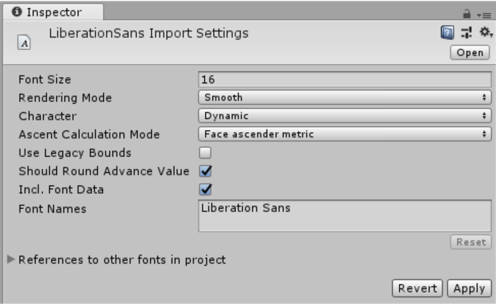

## 2022年3月29日第拾讲 UGUI（下）

#### UI字体

- 避免字体框重叠，造成合批打断

- 字体网格重建
  - UIText组件发生变化时
  - 父级对象发生变化时
  - UIText组件或其父对象enable/disable时
- TrueTypeFontImporter
  - 支持TTF和OTF字体文件格式导入

- 动态字体与字体图集

  - 运行时，根据UIText组件内容，动态生成字体图集，只会保存当前Actived状态的 UIText控件中的字符
  - 不同的字体库维护不同的Texture图集
  - 字体Size、大小写、粗体、斜体等各种风格都会保存在不同的字体图集中（有无必要，影响图集利用效率，一些利用不多的特殊字体可以采用图片代替或使用Custom Font，Font Assets Creater创建静态字体资源）
  - 当前Font Texture不包含UIText需要显示的字体时，当前Font Texture需要重建
  - 如果当前图集太小，系统也会尝试重建，并加入需要使用的字形，文字图集只增不减
  - 利用Font.RequestCharacterInTexture可以有效降低启动时间

- UI控件优化注意事项

  - 不需要交互的UI元素一定要关闭Raycast Target选项
  - 如果是较大的背景图的UI元素建议也要使用Sprite的九宫格拉伸处理，充分减小UI Sprite大小，提高UI Atlas图集利用率
  - 对于不可见的UI元素，一定不要使用材质的透明度控制显隐，因为那样UI网格依然在绘制，也不要采用active/deactive UI控件进行显隐，因为那样会带来gc和重建开销
  - 使用全屏的UI界面时，要注意隐藏其背后的所有内容，给GPU休息机会。
  - 在使用非全屏但模态对话框时，建议使用**OnDemandRendering**接口，对渲染进行降频。
  - 优化裁剪UI Shader，根据实际使用需求移除多余特性关键字。

- 滚动视图Scroll View优化

  - 使用RectMask2d组件裁剪

    使用基于位置的对象池作为实例化缓存