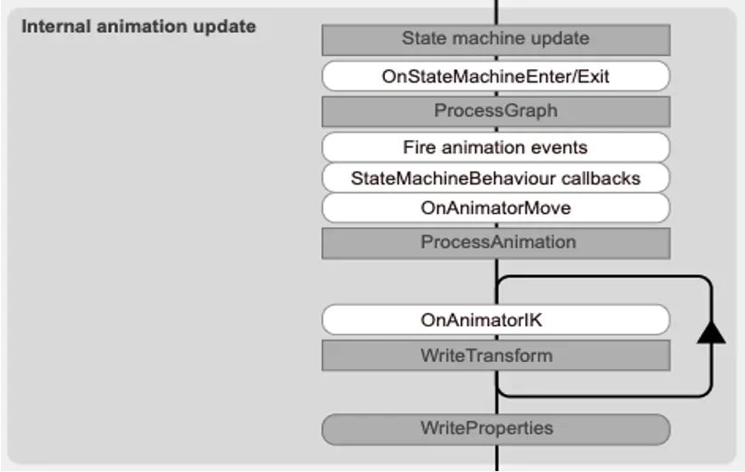

## 2022年4月12日第拾叁讲 动画 

#### Animation的一些细节

- 播放单个AnimationClip速度，Legacy Animation系统更快，因为老系统是直接采样曲线并直接写入对象Transform
- 针对动画的缩放曲线比位移、旋转曲线开销更大
- 常数曲线不会每帧写入场景，更高效

#### Animator的一些细节 

- 不要使用字符串来查询Animator
- 使用曲线标记来处理动画事件
- 使用Target Marching函数来协助处理动画
- 将Animator的CullingMode设置成Based On Renderers来优化动画，并禁用SkinMesh Renderer的Update When Offscreen属性来让角色不可见时动画不更新

#### Internal Animation Update

#### Animator VS Animation 

- Animation可以将任何对象属性制作成Animation Clip, Animator是将Animaiton Clip组织到状态机流程图中使用
- Animation与Animator播放动画时的效率是有个临界点的，这个临界点是根据动画曲线条数来的，当动画曲线条数小于这个临界点时Animation快，当动画曲线条数大于这个临界点时Animator快
- 当Cpu核数较少时，Animation播放动画有优势，当Cpu核数较多时，Animator表现会更好
- Animator Controller Graph中的所有动画节点的Animation Clip都会载入到内存中，当有海量动画状态机节点时，内存开销较大

#### Playable API VS Animator 

**Playable API优点**

- 支持动态动画混合，可为场景中的对象提供自己的动画，并可以动态添加到PlayableGraph当中使用
- 允许创建播放单个动画，而并不会产生创建和管理AnimatorController资源所涉及的开销，可更加灵活的控制PlayableGraph的数据流，可以插入自定义的AimationJob。
- 可以控制动画文件加载策略，按需加载、异步加载等
- 允许用户动态创建混合图，并直接逐帧控制混合权重（甚至可以混合AniationClip与AnimatorController动画）
- 可以运行时动态创建，根据条件添加可播放节点。而不需要提前提供一套PlayableGraph运行时启动和禁用节点，可以做到自由度更高的override机制
- 可加载自定义配置数据，更加方便的和其他游戏系统整合

**Playable API缺点**

- 没有直接使用Animator直观
- 混合模式没有现成的，需要自己实现
- 需要开发更多的配套工具
- 有一定学习成本

#### 解决方案选择 

- 一些简单、少量曲线动画可以使用Animation或动画区间库如Dotween\iTween等完成，如UI动画，Transform动画等。
- 角色骨骼蒙皮动画如果骨骼较少，Animation Clip资源不多，对动画混合表现要求不高的项目可以采用Legacy Animation。注意控制总体曲线数量
- 一些角色动画要求与逻辑有较高的交互、并且动画资源不多的项目可以直接用Animator Graph完成
- 一些动作游戏，对动画混合要求较高、有一些高级动画效果要求、动画资源量庞大的项目，建议采用Animator+Playable API扩展Timeline的方式完成。